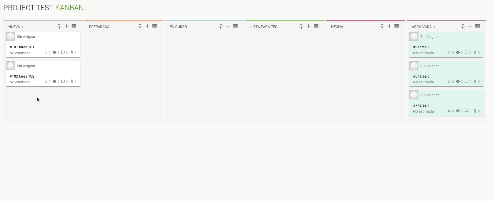

# Taiga Fake
Aplicacion de escritorio fake de la aplicacion [Taiga](https://taiga.io/) para la gestion de proyectos de manera colaborativa.

---------
## Instalación

1. Instalando dependencias
    ```
    npm install
    ```

2. Compilar el proyecto en hot-reload para desarrollo
    ```
    npm run electron:serve
    ```

3. Compilar, minificar y generar el aplicativo AppImage
    ```
    npm run electron:build
    ```

4. Mostrar errores de sintaxis ( `Opcional` )
    ```
    npm run lint
    ```

#### Configuración personalizada
Mira [Configuration Reference](https://nklayman.github.io/vue-cli-plugin-electron-builder/guide/).

> #### Documentación de [Electron](https://electronjs.org/docs/api/browser-window)


--------
## Características


- **Drag & Drop** con la librería [VueDraggable](https://madewithvuejs.com/vue-draggable)

<div align="center">
    
</div>


---------

### Ejemplos de Uso

> https://sortablejs.github.io/Vue.Draggable/#/simple

> https://github.com/nklayman/vue-cli-plugin-electron-builder

> https://developerlife.com/2018/08/22/vue-vueitfy-webpack/#setup-the-new-project

> https://medium.com/@kent_19698/making-a-real-time-electron-app-with-vue-vuetify-and-butterfly-server-net-a4661091f2de